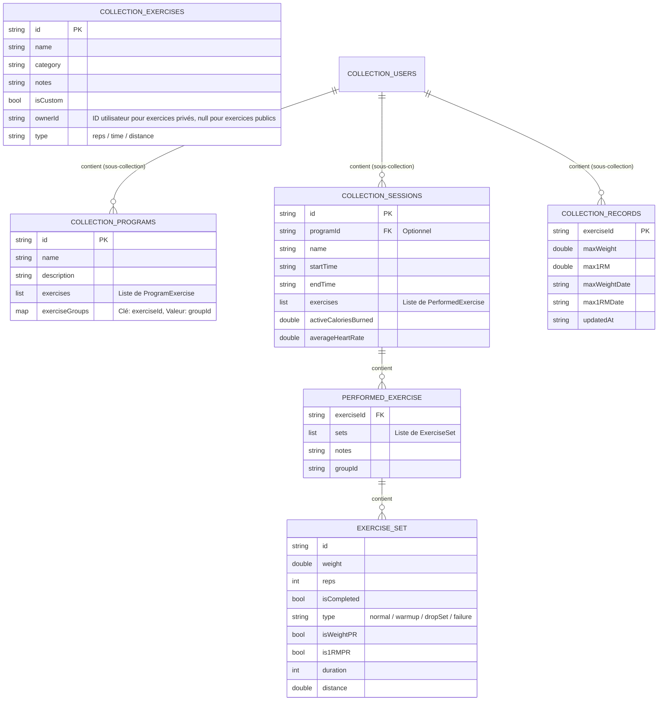

# SportiLife 🏋️‍♂️

Une application Flutter moderne pour suivre vos entraînements de musculation, planifier vos séances et enregistrer votre historique de performances.

## 🚀 Fonctionnalités principales

*   **Gestion des séances** : Planification de programmes (ex: Push, Pull, Legs) et historique complet des séances réalisées.
*   **Persistance Cloud & Cache** : Utilise **Firebase Firestore** pour une synchronisation multi-appareils (Android, iOS, Web, Desktop) avec gestion de cache local synchrone.
*   **Suivi des Records (PR)** : Gestion et stockage dédiés des records personnels (Charge Max et 1RM estimé) pour chaque exercice.
*   **Synchronisation Santé** : Intégration prévue pour synchroniser les entraînements avec Google Fit / Health Connect (Android) et Apple Health (iOS).

---

## 🗄️ Structure de la Base de Données (NoSQL)

L'application utilise **Firebase Firestore**, une base de données NoSQL hébergée dans le cloud et synchronisée. Les données sont cloisonnées par utilisateur au sein de collections de documents. Pour les plateformes Desktop (Windows/Linux), l'intégration se fait via le package `firedart`, tandis que les versions Mobile (Android/iOS) et Web utilisent le SDK officiel Firebase.

### Schéma de données (Modèle NoSQL)



### Description des collections

1. **`exercises` (Collection Racine)** : Contient tous les exercices disponibles. Les exercices publics (communs à tous) possèdent `isCustom: false`. Les exercices privés ont `isCustom: true` et sont filtrés par le champ `ownerId == userId`.
2. **`users/{userId}/programs` (Sous-collection)** : Contient les routines/programmes d'entraînement personnalisés de l'utilisateur.
3. **`users/{userId}/sessions` (Sous-collection)** : Contient l'historique complet des séances réalisées par l'utilisateur. Chaque séance stocke ses exercices effectués, ses séries (`ExerciseSet`) de manière dénormalisée, ainsi que les données énergétiques et cardiaques issues de la synchronisation de santé.
4. **`users/{userId}/records` (Sous-collection)** : Contient les records personnels (PRs de charge maximale et 1RM estimé) pour chaque exercice de l'utilisateur.

---

## 🛠️ Installation et Lancement

1.  **Récupérer les dépendances** :
    ```bash
    flutter pub get
    ```
2.  **Configuration de l'environnement** :
    Vérifiez que le fichier `.env` est présent à la racine du projet.
3.  **Lancer l'application** :
    ```bash
    flutter run
    ```
