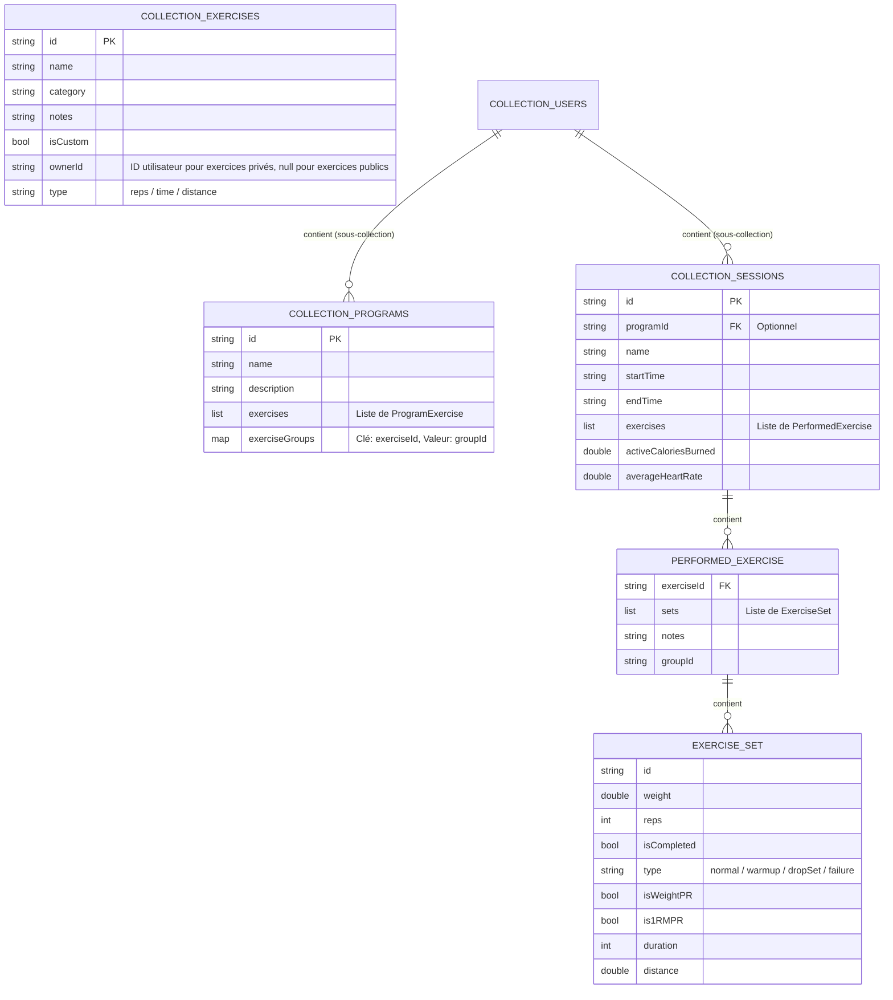

# SportiLife 🏋️‍♂️

Une application Flutter moderne pour suivre vos entraînements de musculation, planifier vos séances et enregistrer votre historique de performances.

## 🚀 Fonctionnalités principales

*   **Gestion des séances** : Planification de programmes (ex: Push, Pull, Legs) et historique complet des séances réalisées.
*   **Persistance locale** : Utilise le package `localstore` pour une base de données locale NoSQL légère, cloisonnée par utilisateur (démarre avec une base de données propre et vide).
*   **Synchronisation Santé** : Intégration prévue pour synchroniser les entraînements avec Google Fit / Health Connect (Android) et Apple Health (iOS).

---

## 🗄️ Structure de la Base de Données (NoSQL)

L'application utilise **Firebase Firestore**, une base de données NoSQL hébergée dans le cloud et synchronisée. Les données sont cloisonnées par utilisateur au sein de collections de documents. Pour les plateformes Desktop (Windows/Linux), l'intégration se fait via le package `firedart`, tandis que les versions Mobile (Android/iOS) et Web utilisent le SDK officiel Firebase.

### Schéma de données (Modèle NoSQL)



### Description des collections

1. **`exercises` (Collection Racine)** : Contient tous les exercices disponibles. Les exercices publics (communs à tous) possèdent `isCustom: false`. Les exercices privés ont `isCustom: true` et sont filtrés par le champ `ownerId == userId`.
2. **`users/{userId}/programs` (Sous-collection)** : Contient les routines/programmes d'entraînement personnalisés de l'utilisateur.
3. **`users/{userId}/sessions` (Sous-collection)** : Contient l'historique complet des séances réalisées par l'utilisateur. Chaque séance stocke ses exercices effectués, ses séries (`ExerciseSet`) de manière dénormalisée, ainsi que les données énergétiques et cardiaques issues de la synchronisation de santé.

---


## ⚠️ Statut de la Synchronisation Santé (En Standby)

La fonctionnalité de synchronisation réelle avec les services de santé (Google Fit / Apple Health) a été mise **en standby** pour simplifier le développement et les tests locaux (évite les fenêtres d'autorisation système intempestives et les configurations complexes).

### État actuel : Mocké 🧪
Dans le fichier [main.dart](file:///home/loris/Documents/GitHub/projetSport/sport_app/lib/main.dart), le service instancié est **[MockHealthSyncService](file:///home/loris/Documents/GitHub/projetSport/sport_app/lib/services/health_sync_service.dart#L127-L158)** :
```dart
// main.dart
final healthSyncService = MockHealthSyncService();
```
*   **Permissions** : Toujours acceptées automatiquement de manière simulée.
*   **Séances** : Simulation réussie d'enregistrement de séances.
*   **Métriques** : Renvoie des valeurs simulées réalistes (ex: 6.5 kcal/min et un rythme cardiaque entre 120-140 bpm selon la durée de la séance).

### Comment réactiver l'intégration réelle ⚡
Pour rétablir la synchronisation directe avec les systèmes natifs (Google Fit / Apple Health) :

1.  Ouvrez le fichier [main.dart](file:///home/loris/Documents/GitHub/projetSport/sport_app/lib/main.dart).
2.  Remplacez `MockHealthSyncService()` par `FlutterHealthSyncService()` :
    ```dart
    final healthSyncService = FlutterHealthSyncService();
    ```
3.  **Configuration requise sur Android** :
    *   S'assurer que les configurations pour *Health Connect* ou *Google Fit* sont complétées dans le fichier `android/app/src/main/AndroidManifest.xml` (déclaration des permissions de lecture/écriture de la fréquence cardiaque et des calories).
4.  **Configuration requise sur iOS** :
    *   Ajouter les clés `NSShareUsageDescription` et `NSUpdateUsageDescription` dans le fichier `ios/Runner/Info.plist`.
    *   Activer la capacité *HealthKit* dans votre projet Xcode.

---

## 🛠️ Installation et Lancement

1.  **Récupérer les dépendances** :
    ```bash
    flutter pub get
    ```
2.  **Configuration de l'environnement** :
    Vérifiez que le fichier `.env` est présent à la racine du projet.
3.  **Lancer l'application** :
    ```bash
    flutter run
    ```
