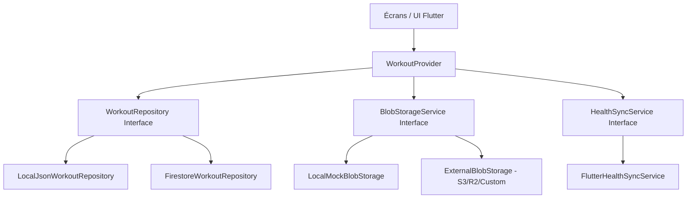

# Plan d'implémentation - Application de suivi de musculation (`sport_app`)

> [!IMPORTANT]
> **CONSIGNE CRITIQUE : NE PAS TOUCHER AU DOSSIER `codelabs_app`**
> Le dossier `codelabs_app` présent dans le répertoire est un ancien projet d'apprentissage compressé/sauvegardé. **Il ne doit être ni modifié, ni supprimé, ni altéré.**
> Toute l'application de sport doit être créée de toutes pièces dans un nouveau sous-dossier dédié nommé `sport_app`.

---

## 🚀 Étape 1 : Création du projet à partir de zéro
Dans le dossier racine `/home/loris/Documents/GitHub/projetSport`, initialisez le nouveau projet en exécutant la commande suivante dans le terminal :
```bash
flutter create sport_app
```
*Note : Le développement commencera à partir d'un dossier entièrement vide pour `sport_app`.*

---

## 🏗️ Architecture de l'Application

L'application utilisera le package `provider` pour la gestion de l'état global et un stockage local au format JSON via `path_provider` pour assurer la persistance des programmes et des séances passées.



### A. Persistance des Données (Base de données / Textes)
1.  **Interface Commune (`WorkoutRepository`)** : Déclare les méthodes de CRUD pour les programmes, les exercices et les séances (ex: `saveSession`, `getHistory`, `getPrograms`).
2.  **Implémentation Locale (`LocalJsonWorkoutRepository`)** : 
    *   Utilise `path_provider` pour écrire dans le dossier sécurisé du téléphone.
    *   Sauvegarde les objets en JSON dans `programs.json` et `history.json`.
3.  **Implémentation Cloud (`FirestoreWorkoutRepository`)** :
    *   Synchronise les documents JSON sur Cloud Firestore (Firebase) sous le compte Google dédié.
    *   Profite du cache hors-ligne natif de Firestore pour une réactivité mobile immédiate.

### B. Gestion des Fichiers (Blobs)
Pour stocker des fichiers (comme des photos d'exercices, des exports de données ou des sauvegardes d'images de performance) sans encombrer Firestore :
1.  **Interface Commune (`BlobStorageService`)** : Déclare des méthodes d'envoi de flux d'octets (`uploadBlob(String path, List<int> bytes)`).
2.  **Implémentation Externe (`ExternalBlobStorage`)** : Gère l'envoi vers un service de stockage d'objets (ex: Cloudflare R2, AWS S3 ou Supabase Storage) via des requêtes HTTP Multipart, séparément de la base Firebase principale.

---

## 🩺 2. Intégration des Données de Santé (Google Health Connect & Apple Health)

Nous utiliserons le package standard **`health`** (qui supporte les API modernes **Google Health Connect** sur Android et **Apple HealthKit** sur iOS) pour récupérer et écrire des données de santé.

### Données Récupérables / Synchronisables
Pour chaque séance effectuée :
1.  **Enregistrement de la séance (Écriture)** : L'application enregistre l'entraînement en tant qu'activité de musculation (*Active Workout - Strength Training*) avec l'heure de début et de fin.
2.  **Récupération des constantes (Lecture)** : Durant l'intervalle de temps de la séance, l'application peut requérir la **Fréquence cardiaque** (moyenne et maximale) et l'estimation des **Calories brûlées activement** (Active Calories Burned).

---

## 🏆 3. Moteur de Records Personnels (Personal Records - PR)

Un système de Records Personnels (PR) sera intégré directement au cœur logique de l'application pour motiver l'utilisateur et suivre sa progression.

### A. Les types de records suivis par exercice
Pour chaque exercice, l'application analyse l'historique pour détecter trois types de records :
1.  **Record de charge brute (Max Weight PR)** : Le poids le plus lourd jamais soulevé sur cet exercice (ex: 100 kg au développé couché).
2.  **Record de volume estimé (Estimated 1RM PR)** : La meilleure performance relative estimée en une seule répétition (calculée selon la formule d'Epley : $1RM = Poids \times (1 + Reps / 30)$).
3.  **Record de répétitions par charge (Rep PR)** : Le nombre maximal de répétitions réalisées pour un poids spécifique (ex: record de 12 répétitions à 80 kg).

### B. Détection en temps réel (Pendant la séance)
1.  Dès que l'utilisateur coche la case de complétion d'une série (`isCompleted = true`), le `WorkoutProvider` compare instantanément cette série avec tout l'historique de cet exercice.
2.  Si un record est battu, un petit indicateur visuel sobre (ex: une couronne discrète `👑` ou un badge `PR` de couleur bleue athlétique) apparaît immédiatement à côté de la série concernée.
3.  **Écran de résumé** : À la fin de la séance (lors de la validation), un écran récapitulatif affiche fièrement tous les records personnels qui ont été battus durant l'entraînement.

---

## 🗃️ 4. Modèles de Données Précis (`sport_app/lib/models/`)

### Exercice (`exercise.dart`)
```dart
class Exercise {
  final String id;
  final String name;
  final String category; // ex: Pectoraux, Dos, Jambes, Cardio
  final String? notes; 
  final bool isCustom; 

  Exercise({
    required this.id,
    required this.name,
    required this.category,
    this.notes,
    this.isCustom = false,
  });
}
```

### Série d'Exercice (`exercise_set.dart`)
```dart
enum SetType { normal, warmup, dropSet, failure }

class ExerciseSet {
  final String id;
  double weight; // Poids en kg
  int reps; // Répétitions effectuées
  bool isCompleted; // Validée par la case à cocher
  final SetType type;
  
  // Attributs calculés localement pour les records
  bool isWeightPR;
  bool is1RMPR;

  ExerciseSet({
    required this.id,
    this.weight = 0.0,
    this.reps = 0,
    this.isCompleted = false,
    this.type = SetType.normal,
    this.isWeightPR = false,
    this.is1RMPR = false,
  });

  // Calcul du One Rep Max estimé (Formule d'Epley)
  double get estimated1RM {
    if (reps <= 1) return weight;
    return weight * (1 + reps / 30.0);
  }
}
```

### Exercice Réalisé (`performed_exercise.dart`)
```dart
class PerformedExercise {
  final String exerciseId;
  final List<ExerciseSet> sets;
  String? notes; 

  PerformedExercise({
    required this.exerciseId,
    required this.sets,
    this.notes,
  });
}
```

### Séance d'Entraînement (`workout_session.dart`)
```dart
class WorkoutSession {
  final String id;
  final String? programId;
  final String name;
  final DateTime startTime;
  final DateTime? endTime;
  final List<PerformedExercise> exercises;
  
  // Données de santé
  double? activeCaloriesBurned;
  double? averageHeartRate;

  WorkoutSession({
    required this.id,
    this.programId,
    required this.name,
    required this.startTime,
    this.endTime,
    required this.exercises,
    this.activeCaloriesBurned,
    this.averageHeartRate,
  });
}
```

---

## 🎨 5. Spécifications du Design (Style Épuré & Athlétique)

Afin d'éviter l'effet "néons / IA générique" (iaSlop), nous adopterons une esthétique minimaliste et sportive haut de gamme.

### Palette de Couleurs
*   **Arrière-plan principal** : Gris ardoise ultra-sombre (`#121214`) ou Blanc cassé mat (`#F8FAFC`).
*   **Surfaces (Cartes, Panneaux)** : Gris ardoise doux (`#1E1E24`) ou Blanc pur (`#FFFFFF`).
*   **Bordures et Séparateurs** : Gris neutre discret (`#2D2D34` ou `#E2E8F0`).
*   **Accentuation Sportive** : Bleu athlétique profond (`#2563EB`) pour les boutons principaux et badges de records.
*   **Validation de Série** : 
    *   *Mode Sombre* : Fond de ligne passant à un gris-vert très sombre (`#142F23`), avec une coche verte discrète (`#10B981`).
    *   *Mode Clair* : Fond de ligne passant à un vert très clair (`#ECFDF5`), avec une coche verte discrète (`#10B981`).

### Ergonomie Mobiles (Séance active)
*   **Visualisation des Chronos** : Affichage d'un temps de repos (Rest Timer) personnalisable qui démarre dès qu'une série est validée (coche). Un bandeau discret s'affiche en bas d'écran avec une barre de progression linéaire et un signal sonore doux ou vibration en fin de décompte.
*   **Saisie Rapide** : Les champs de saisie de poids/reps auront de grands boutons `+` et `-` de part et'autre pour incrémenter rapidement sans ouvrir le clavier virtuel (idéal pendant l'entraînement).

---

## 📁 6. Organisation de l'Interface Utilisateur (Screens dans `sport_app/lib/screens/`)

### 📊 A. Le Tableau de Bord (`dashboard_screen.dart`)
*   **Statistiques Hebdomadaires** : Graphique en barre simple ou indicateur de progression (ex : "3 séances cette semaine").
*   **Volume d'Entraînement** : Somme des tonnes soulevées sur la semaine écoulée.
*   **Actions directes** : 
    *   "Nouvelle Séance Vide" (démarrage à la volée).
    *   "Reprendre le programme [Nom du Programme]" (raccourci dynamique).

### 📋 B. Bibliothèque de Programmes (`programs_screen.dart`)
*   Visualisation de vos programmes (ex: "Push / Pull / Legs").
*   Interface de création : titre, description, et sélection d'exercices dans une liste de recherche avec filtres par groupe musculaire.
*   Modification de l'ordre des exercices par glisser-déposer (ReorderableListView).

### ⏱️ C. Suivi Actif (`active_session_screen.dart`)
*   **Timer global** de la séance en cours d'exécution.
*   **Liste d'exercices** avec affichage des séries prévues.
*   Case à cocher pour chaque série validant la performance. Un petit badge `👑` s'affiche si la série est détectée comme un record en temps réel.
*   Possibilité d'ajouter des exercices au milieu de la séance ou de supprimer une série.
*   Bouton "Terminer" en bas pour valider l'historique et enregistrer les données.

### 🏛️ D. Historique (`history_screen.dart`)
*   Vue sous forme de liste chronologique (triée par mois).
*   Chaque carte indique : le nom de la séance, la durée, le volume total, et un résumé des exercices.
*   Détail au clic montrant les répétitions exactes, le 1RM estimé de chaque série lourde, ainsi que les données de santé récupérées et les records personnels (PR) battus durant cette séance (marqués d'un badge bleu athlétique).
